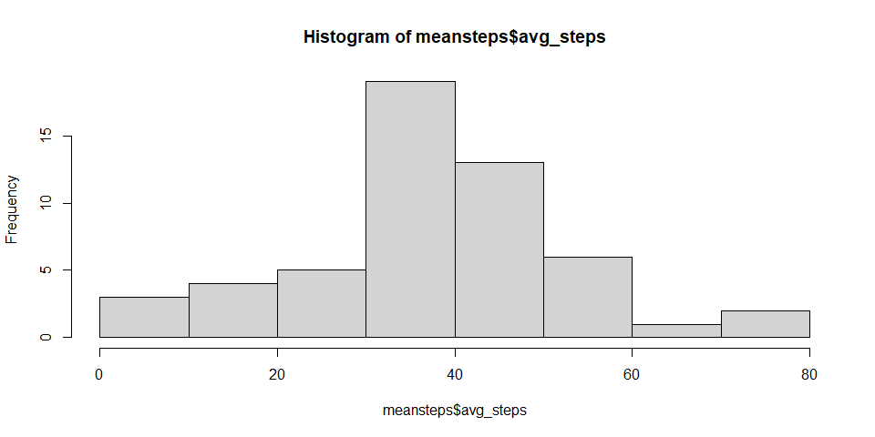
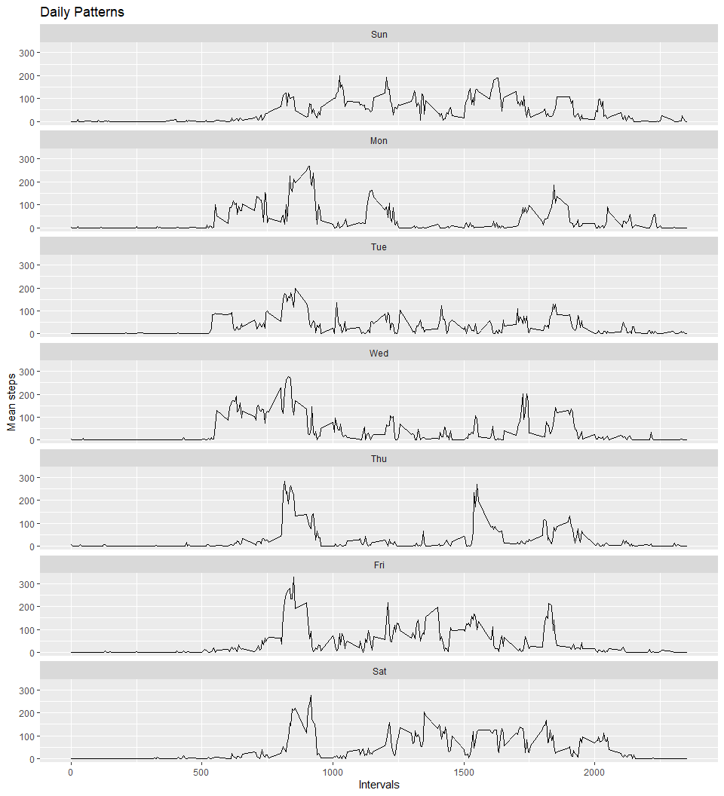
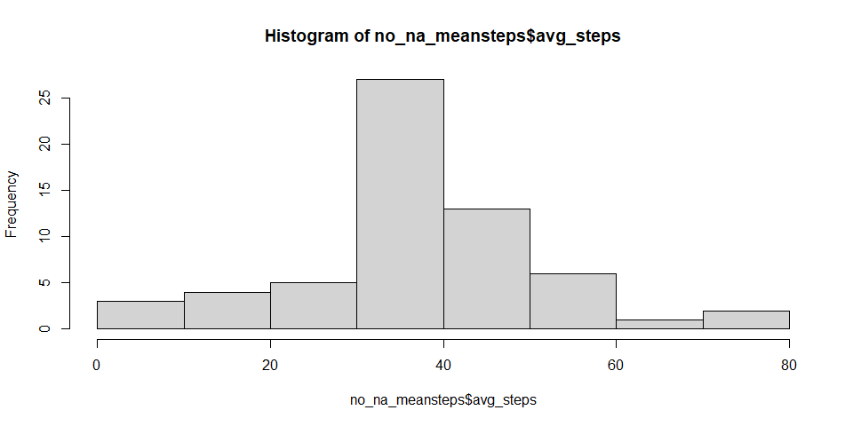
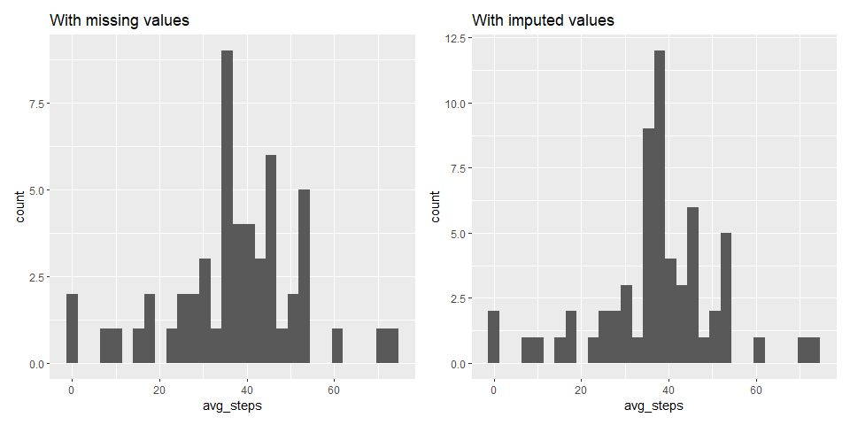
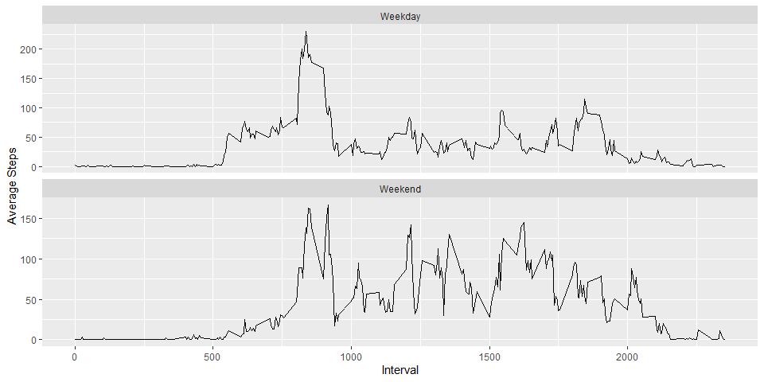

## Loading and preprocessing the data

Adding necessary libraries


``` r
library(data.table)
library(here)
library(tidyverse)
library(patchwork)
```

 First I added the data directly from the link, explored the zip file and then loaded
 the data into the `activity` data frame.
 

``` r
  #Directory
if(!dir.exists("./data")){dir.create(here("./data"))}#Set-up directory for work and data
  #Download data
url <- "https://d396qusza40orc.cloudfront.net/repdata%2Fdata%2Factivity.zip"
temp <- tempfile() #Temporary variable to save zip file
download.file(url,temp)

  #Export data
unzip(temp, list = TRUE) #Explore zip folder
```

```
##           Name Length                Date
## 1 activity.csv 350829 2014-02-11 10:08:00
```

``` r
zip_list <- as.vector(unzip(temp, list = TRUE)[,1]) #Save structure
activity <- read.csv2(unzip(temp, zip_list[1]), sep=",")

unlink(temp); rm(temp, url, zip_list) #Delete temporary files

#Explore Data
head(activity)
```

```
##   steps       date interval
## 1    NA 2012-10-01        0
## 2    NA 2012-10-01        5
## 3    NA 2012-10-01       10
## 4    NA 2012-10-01       15
## 5    NA 2012-10-01       20
## 6    NA 2012-10-01       25
```

``` r
str(activity)
```

```
## 'data.frame':	17568 obs. of  3 variables:
##  $ steps   : int  NA NA NA NA NA NA NA NA NA NA ...
##  $ date    : chr  "2012-10-01" "2012-10-01" "2012-10-01" "2012-10-01" ...
##  $ interval: int  0 5 10 15 20 25 30 35 40 45 ...
```
 Since date is not formatted as date, I corrected that.
 

``` r
  #Convert to right format
activity$date <- as.Date(as.character(activity$date), "%Y-%m-%d")
str(activity)
```

```
## 'data.frame':	17568 obs. of  3 variables:
##  $ steps   : int  NA NA NA NA NA NA NA NA NA NA ...
##  $ date    : Date, format: "2012-10-01" "2012-10-01" ...
##  $ interval: int  0 5 10 15 20 25 30 35 40 45 ...
```
 
## What is mean total number of steps taken per day?

To better understand the date, I added a label name for the days using `lubridate`.


``` r
activity <- activity %>%
  mutate(day = lubridate::wday(date, label = TRUE))
```

After that, I created two variables `dailysteps` and `meansteps`.


``` r
dailysteps <- activity %>%
  group_by(date) %>%
  summarise(total_steps = sum(steps, na.rm=T))

meansteps <- activity %>%
  group_by(date) %>%
  summarise(avg_steps = mean(steps, na.rm=T))
```

Below we can see the distribution of average steps per day:


``` r
hist(meansteps$avg_steps)
```

<!-- -->

The mean total number of steps taken per day is:


``` r
mean(dailysteps$total_steps)
```

```
## [1] 9354.23
```


## What is the average daily activity pattern?

To see the daily pattern, I used `ggplot` and created a new variable `dpattern`.


``` r
dpattern <- activity %>%
  group_by(day, interval) %>%
  summarise(mean_steps = mean(steps, na.rm=T))
```

```
## `summarise()` has grouped output by 'day'. You can override using the `.groups`
## argument.
```

Below the graph and the code for its creation:

``` r
patternplot <- ggplot(dpattern, aes(dpattern$interval, dpattern$mean_steps))

patternplot + 
  geom_line() +
  labs(title = "Daily Patterns",x="Intervals",y="Mean steps") +
  facet_wrap(.~day, ncol=1) 
```

<!-- -->


## Imputing missing values

First, I quantified the amount of missing values:


``` r
sum(rowSums(is.na(activity)))
```

```
## [1] 2304
```

Given the amount (2304), and that they are distributed across different dates, I changed the layout of the table with `pivot_wider` adding the intervals as columns, then I ran a `for loop` to input the column mean for the given interval where there was missing values.


``` r
no_na_activity <- activity %>%
pivot_wider(names_from = interval, values_from = c(steps))

names(no_na_activity) <- make.names(names(no_na_activity)) #Made sure the names are valid

head(no_na_activity)
```

```
## # A tibble: 6 × 290
##   date       day      X0    X5   X10   X15   X20   X25   X30   X35   X40   X45
##   <date>     <ord> <int> <int> <int> <int> <int> <int> <int> <int> <int> <int>
## 1 2012-10-01 Mon      NA    NA    NA    NA    NA    NA    NA    NA    NA    NA
## 2 2012-10-02 Tue       0     0     0     0     0     0     0     0     0     0
## 3 2012-10-03 Wed       0     0     0     0     0     0     0     0     0     0
## 4 2012-10-04 Thu      47     0     0     0     0     0     0     0     0     0
## 5 2012-10-05 Fri       0     0     0     0     0     0     0     0     0     0
## 6 2012-10-06 Sat       0     0     0     0     0     0     0     0     0     0
## # ℹ 278 more variables: X50 <int>, X55 <int>, X100 <int>, X105 <int>,
## #   X110 <int>, X115 <int>, X120 <int>, X125 <int>, X130 <int>, X135 <int>,
## #   X140 <int>, X145 <int>, X150 <int>, X155 <int>, X200 <int>, X205 <int>,
## #   X210 <int>, X215 <int>, X220 <int>, X225 <int>, X230 <int>, X235 <int>,
## #   X240 <int>, X245 <int>, X250 <int>, X255 <int>, X300 <int>, X305 <int>,
## #   X310 <int>, X315 <int>, X320 <int>, X325 <int>, X330 <int>, X335 <int>,
## #   X340 <int>, X345 <int>, X350 <int>, X355 <int>, X400 <int>, X405 <int>, …
```

Since the data is now in the format I want, I ran the code:


``` r
for(i in 3:ncol(no_na_activity)) {
  no_na_activity[,i][is.na(no_na_activity[,i])] <- as.integer(colMeans(no_na_activity[,i],na.rm = TRUE))
}
```

Changed the table back to a long format and removed the "X" character from the interval.


``` r
no_na_activity <- pivot_longer(no_na_activity, 
                               cols = 3:290, 
                               names_to = "interval", 
                               values_to = "steps")
no_na_activity$interval <- as.numeric(gsub("X", "",as.character(no_na_activity$interval)))
```


The histogram without missing values


``` r
no_na_meansteps <- no_na_activity %>%
  group_by(date) %>%
  summarise(avg_steps = mean(steps, na.rm=T))

hist(no_na_meansteps$avg_steps)
```

<!-- -->

Side to side comparison:

``` r
hist1 <- ggplot(meansteps, aes(x = avg_steps)) + geom_histogram() + labs(title = "With missing values")
hist2 <- ggplot(no_na_meansteps, aes(x = avg_steps)) + geom_histogram() + labs(title = "With imputed values")

hist1 + hist2 + plot_layout(ncol = 2)
```

<!-- -->


## Are there differences in activity patterns between weekdays and weekends?

To see the weekends and weekday patterns, I created a new dataset `weeks` and plotted the steps in each factor.


``` r
weeks <- no_na_activity %>% 
  mutate(weeks = case_when(
    day=="Sun" ~ "Weekend",
    day == "Sat" ~ "Weekend",
    TRUE ~ "Weekday"
  ))

weeks <- weeks %>% 
  group_by(weeks, interval) %>%
  summarise(avg_steps = mean(steps))
```

```
## `summarise()` has grouped output by 'weeks'. You can override using the
## `.groups` argument.
```

``` r
ggplot(weeks, aes(interval, avg_steps)) + 
  geom_line() + 
  facet_wrap(~ weeks, scales = "free_y", ncol = 1) +
  ylab("Average Steps") + xlab("Interval")
```

<!-- -->

